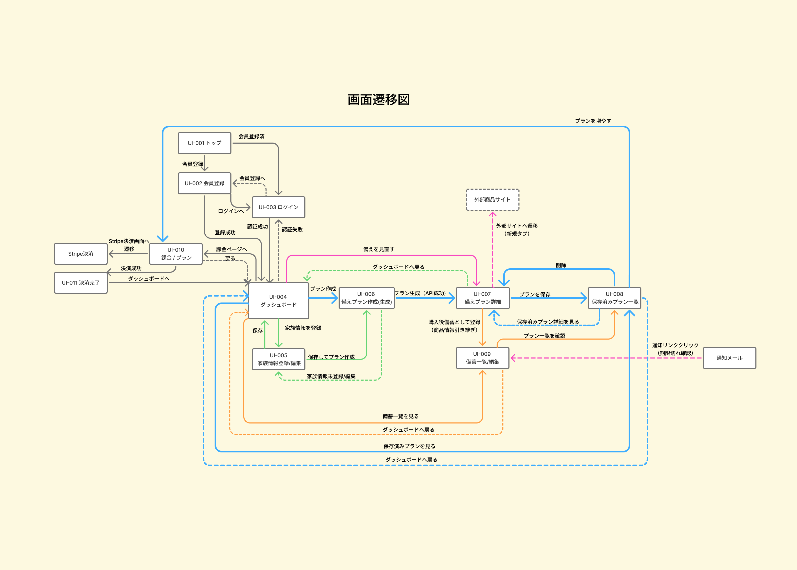

# 画面設計書（Screen Design）

## 1. 概要

本ドキュメントは、食物アレルギー家庭向け防災備蓄支援アプリ「そなえアレ」における画面仕様を定義する。

本システムは、家族条件に応じたAIによる備えプランの提案、商品購入導線、備蓄登録、期限・コスト管理、通知による確認までを一気通貫で提供する。

---

## 2. 画面一覧

| 画面ID | 画面名              | パス             |
| ------ | ------------------- | ---------------- |
| UI-001 | トップ画面          | /                |
| UI-002 | 会員登録画面        | /signup          |
| UI-003 | ログイン画面        | /login           |
| UI-004 | ダッシュボード      | /dashboard       |
| UI-005 | 家族情報登録 / 編集 | /family          |
| UI-006 | 備えプラン作成      | /plan/new        |
| UI-007 | 備えプラン詳細      | /plans/:id       |
| UI-008 | 保存済みプラン一覧  | /plans           |
| UI-009 | 備蓄品一覧          | /inventory       |
| UI-010 | 料金プラン          | /billing         |
| UI-011 | 決済完了            | /billing/success |

---

## 3. 画面遷移図

### 3.1 画面遷移図の考え方

本アプリは以下の一連の流れを支援する設計とする。

**提案 → 購入 → 保存 → 管理 → 通知 → 確認 → 再購入**

### 3.2 画面遷移図

### 3.3 Figmaリンク

https://xxxxx（Figma URL）

---

## 4. 各画面設計

---

### UI-001 トップ画面（/）

#### 目的

ユーザーにサービスの価値を伝え、登録・ログインへ誘導する

#### 主な要素

- アプリ名
- キャッチコピー
- サービス説明
- 「無料で始める」ボタン
- 「ログイン」ボタン
- 特徴説明
  - 家族条件に合う備えを提案
  - 日常転用品も候補表示
  - 期限通知で見直しやすい

#### 遷移

- 会員登録画面へ
- ログイン画面へ

---

### UI-002 会員登録画面（/signup）

#### 目的

新規ユーザー登録を行う

#### 入力項目

- メールアドレス
- パスワード

#### 遷移

- ダッシュボードへ
- ログイン画面へ

---

### UI-003 ログイン画面（/login）

#### 目的

ユーザー認証を行う

#### 入力項目

- メールアドレス
- パスワード

#### 遷移

- ダッシュボードへ
- 会員登録画面へ

---

### UI-004 ダッシュボード（/dashboard）

#### 目的

備えの全体状況を一画面で把握できる

#### 主な要素

- 家族情報カード
- コスト概要カード
  - 年間維持コスト
- 期限が近い商品カード
- 備蓄品一覧カード
- 料金プランカード
- 保存済みプラン一覧
- プラン作成導線

#### 遷移

- 家族情報画面
- プラン作成画面
- プラン詳細画面
- 備蓄品一覧画面
- 料金プラン画面
- 保存済みプラン一覧画面

---

### UI-005 家族情報登録 / 編集画面（/family）

#### 目的

備え提案の前提となる家族・アレルギー情報を管理する

#### 入力項目

- 続柄
- 年齢区分
- アレルゲン
- メモ

#### 遷移

- ダッシュボードへ
- プラン作成画面へ

---

### UI-006 備えプラン作成画面（/plan/new）

#### 目的

AIによる備えプランを生成する

#### 入力項目

- 想定日数（3日 / 7日）
- 候補範囲（防災食のみ / 日常品含む）
- 優先方針（最低限 / バランス重視）

#### 遷移

- 備えプラン詳細画面へ

---

### UI-007 備えプラン詳細画面（/plans/:id）

#### 目的

提案内容を確認し、保存・行動につなげる。

当初MVP対象外として整理していた備えプラン編集機能については、追加機能として本画面に限定的に実装する。
保存済みプランに対して、プラン名・人数・日数を編集し、必要に応じて商品の数量を再計算したうえで保存できるようにする。

#### 主な要素

- プラン条件（プラン名・人数・日数・方針）
- 初期費用
- 年間維持コスト
- 商品一覧
  - 商品名
  - 数量
  - カテゴリ
  - 商品種別
  - 価格
  - 商品サイトへのリンク
  - 備蓄登録導線
- AI説明補助
- 注意文
- プラン名の編集欄
- 人数の編集欄
- 日数の編集欄
- 再計算ボタン
- 保存ボタン

#### 補足仕様

- 追加機能としての編集可能項目は `プラン名 / 人数 / 日数` に限定する
- 人数・日数変更時の再計算対象は `商品の数量のみ` とする
- 商品構成、カテゴリ、商品種別、価格、AI説明補助、注意文は編集対象外とする
- `プラン名` の変更は数量再計算に影響しない
- `人数` または `日数` を変更しただけでは商品数量は自動更新しない
- `再計算ボタン` 押下時に、変更後の人数・日数をもとに商品の数量を更新する
- 保存前は未保存の編集状態として扱い、保存後は更新内容を反映した詳細画面を再表示する

#### 遷移

- 備蓄品一覧画面
- 商品サイト（外部）
- ダッシュボード
- プラン保存
- プラン削除
- 再計算（同画面内で数量更新）
- 保存（同画面内で更新内容反映）

---

### UI-008 保存済みプラン一覧画面（/plans）

#### 目的

保存済みプランの確認・削除

#### 主な要素

- プラン一覧
- 件数表示
- 詳細表示導線
- 削除導線
- 料金プラン導線

#### 遷移

- プラン詳細画面
- ダッシュボード
- 料金プラン画面

---

### UI-009 備蓄品一覧画面（/inventory）

#### 目的

実際の備蓄管理を行う

#### 主な要素

- 期限が近い商品一覧
- 備蓄登録フォーム
  - 商品名（自由入力可）
  - 数量
  - 賞味期限
  - 単価
- 登録済み備蓄商品一覧
- 削除導線
- 備蓄コスト目安

#### 遷移

- 保存済みプラン一覧画面
- ダッシュボード

---

### UI-010 料金プラン画面（/billing）

#### 目的

無料 / 有料プランの切替

#### 主な要素

- 無料プラン（保存1件）
- 有料プラン（保存無制限）
- 決済導線
- 解約導線

#### 遷移

- 決済画面（Stripe）
- ダッシュボード

---

### UI-011 決済完了画面（/billing/success）

#### 目的

決済完了のフィードバック

#### 遷移

- ダッシュボード

---

## 5. UXフロー

1. トップ画面でサービス理解
2. ユーザー登録 / ログイン
3. 家族情報登録
4. 備えプラン作成
5. 商品確認・購入
6. 備蓄登録
7. ダッシュボードで確認
8. 通知受信
9. 備蓄確認
10. 再購入・管理

---

## 6. 設計上の重要ポイント

### 6.1 一気通貫体験

提案だけで終わらず、
「購入 → 登録 → 管理 → 通知 → 再購入」までつなげる

### 6.2 MVPスコープ遵守

以下は対象外

- 専用のプラン編集画面
- 備蓄商品編集
- 高度通知機能

ただし、備えプラン編集機能は当初MVP対象外として整理していた追加機能として、備えプラン詳細画面（UI-007）に限定的に実装する。
編集可能項目は `プラン名 / 人数 / 日数` に限定し、人数・日数変更時の再計算対象は `商品の数量のみ` とする。

### 6.3 AIの位置づけ

- 提案と説明補助のみ
- 最終判断はユーザー

---

## 7. 今後の拡張余地

- 通知カスタマイズ
- 商品情報自動取得
- モバイル最適化
